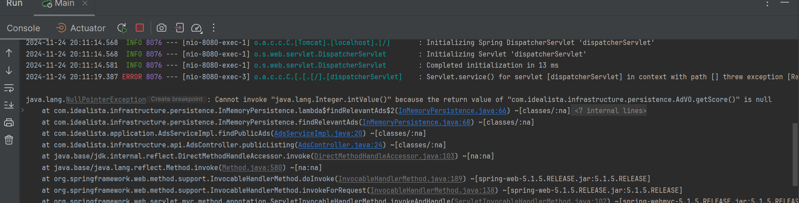

# Code Review

## A) Cuestiones que hubiese preguntado en un refinamiento

1. **¿Esto también lo sumamos al proceso de creación de una publicación? ¿Solo al de actualización/modificación?**
2. **En caso de que no se quiera agregar en el proceso mismo (de creación/modificación), se ejecutará cada ventana de tiempo determinada?**  
   ¿Cada 1 día, cada hora, etc.?
3. **¿Los puntos son constantes o se necesitarían cambiar habitualmente?**  
   Esto es importante para saber si es mejor agregar archivos de configuración que no dependan de deploys solo por esto.
4. **¿Se va a realizar en todos los países?**  
   Para ver si usamos configuraciones de encendido/apagado por región.
5. **En el caso de que una publicación no cumpla con los estándares (<40 pts.), se necesita mostrar alguna información en el frontal?**  
   ¿Hay que crear algún modal con información, enviar algún correo, etc.?  
   Esto nos ayuda a saber si necesitamos devolver información para renderizar la web.

## B) Code Review realizado entendiendo lo acotado del contexto

### Clean Architecture: Arquitectura Hexagonal

Lo primero que revisé al entrar al proyecto fue la estructura de carpetas para situarme. Veo que se encuentran las 3 capas: **Infraestructura**, **Aplicación** y **Dominio**.

Entiendo que para un caso de uso como este, algunas cosas no serían necesarias, pero a continuación agrego algunos comentarios:

### Dominio:

- **Creación de otros paquetes**:
	- `domain/model`: donde colocaría todas las entidades del modelo.
		- `/dto`: Para los objetos de transferencia de datos.
		- `/constants`: Para enums (como Typology, Quality) y clases de constantes.  
		  En esta implementación, renombraría la clase `Constants`, ya que no es un nombre que refleje lo que se está haciendo. Actualmente, se utiliza para validar tamaños de strings y asignar puntos a publicaciones, lo cual no justifica ese nombre.
	- `domain/port`: Colocaría la interfaz `AdRepository`.

- **Lombok**:
  Usaría esta biblioteca que provee anotaciones para reducir la extensión del código y mejorar su legibilidad.  
  Ejemplos:
	- En la clase `Ad` o `Picture`, podemos usar anotaciones como `@EqualsAndHashCode`, `@AllArgsConstructor`, `@Getter`, `@Setter`, `@Data`, etc., para evitar escribir manualmente el constructor, getters, setters, equals, hashCode, etc.
	- Lombok también facilita el uso de Builders, para crear entidades más complejas fácilmente.

### Aplicación:

- **Creación de otros paquetes**:
	- `application/usescases`: Donde pondría todos los casos de uso, como la interfaz `AdsService`.
	- `application/services`: Para las implementaciones de esos servicios.

- **Comentarios**:
	- En la implementación `AdsServiceImpl`, hay código duplicado que se podría refactorizar (en `AdsServiceImpl#45`). Sería útil extraerlo a un método aparte para centralizar la lógica y facilitar futuros cambios.
	- Renombraría algunas variables para hacer el código más claro. Prefiero que el código sea autoexplicativo, evitando comentarios innecesarios.

### Infraestructura:

- **Creación de otros paquetes**:
	- `infrastructure/mappers`: Donde colocaría los mappers de `InMemoryPersistence` (como en `InMemoryPersistence#80`, `InMemoryPersistence#91`, etc.). Extraerlos a una clase dedicada mejoraría la estructura.
	- Usaría **MapStruct** para generar los mappers en tiempo de compilación, evitando tener que escribirlos manualmente. Crearíamos una interfaz con la anotación `@Mapper` para mapear los objetos automáticamente. Si se requiere lógica personalizada, podemos crear métodos en el mapper usando las anotaciones de MapStruct.
	- `infrastructure/rest`: Donde colocaría los controladores.
	- `infrastructure/adapters`: Para repositorios de bases de datos o conexiones a APIs externas.

- **Comentarios**:
	- El controlador está bien definido y no contiene lógica de negocio, que está correctamente separada en los servicios.
	- Agregaría una clase `@ControllerAdvice` que nos provee Spring Boot para el manejo de excepciones globales.

### Tests:

- Hay un solo test para `AdsServiceImpl`. Sugiero agregar más paquetes de tests con la misma estructura que tenemos en `src`, y crear un test para cada clase que necesitemos.  
  La lógica distribuida en otras clases, como los controladores, no tiene cobertura. Si utilizáramos una herramienta de inspección de código como Sonar, el coverage de la PR probablemente no pasaría.

- Al ejecutar el test `AdsServiceImplTest`, noté que algunos métodos no están cubiertos:
	- `findPublicAds`, `findQualityAds`, y varias líneas en `calculateScore` (líneas 78, 96, 105-106, 129) no tienen cobertura, incluyendo casos como cuando la foto no es HD y se le suman 10 puntos.

- Agregaría constantes para reemplazar literales en el código (por ejemplo, "luminoso" en `AdsServiceImpl#110`).

### Consideraciones Adicionales:

- **README**:  
  Entiendo que este archivo haya sido utilizado para el enunciado del ejercicio, pero deberíamos tener información más detallada sobre la aplicación, como cómo se levanta, qué necesita, qué versiones utiliza, sus lineamientos, etc.

- **Manejo de Excepciones**:  
  Actualmente no se están manejando excepciones en el código. Si ocurre un error, como un formato incorrecto o un `NullPointerException`, podría generar fallos inesperados en el sistema.  
  De hecho, al levantar la aplicación localmente y realizar una llamada a `ads/public`, se lanza un error `NullPointerException` en `InMemoryPersistence#66`. Propongo manejar estas excepciones y, por ejemplo, loguearlas o mostrarlas en el frontend para permitir una acción correcta.

- **Uso de Tildes**:  
  Algunos literales contienen tildes (por ejemplo, en `AdsServiceImpl#112`), lo que podría generar problemas de encoding. Deberíamos asegurarnos de que esto esté contemplado.

- **Swagger UI**:  
  Agregaría Swagger UI en el `pom.xml` para generar una interfaz visual de los endpoints, permitiendo documentarlos con anotaciones y facilitando su ejecución desde la web. Esto permitiría a los stakeholders utilizar la API sin necesidad de instalar herramientas como Postman o ejecutar comandos complejos de `curl`.

